# pdl

> Platform of deep learning：数据采集与标注、算法训练、算法部署一站式深度学习平台


# 项目简介
深度学习算法应用的生产迭代流程主要包括以下环节:数据采集与标注、算法训练、算法部署。根据以上三个基础环节以及深度学习应用的特性，可以将深度学习平台划分为两个基础功能模块与四个业务功能模块。
## 基础功能模块:
1. 存储模块:该模块的主要作用是提供存储功能，包括关系型数据存储 与文件数据存储。
2. 容器模块:该模块的主要作用是提供算法运行的环境支持与容器编排 支持。鉴于容器技术在此问题上的适用性，并且管理多个容器协同工作也是系统 的关注点之一，所以采用 Docker + Kubernetes 的技术方案。
## 业务功能模块:
1. 数据集管理模块:该模块主要针对图像数据进行管理。包括数据导入 与标注等基础功能。此外，为了提升数据标注的效率与准确率，系统采用了特定 算法辅助用户进行数据标注。
2. 算法训练模块:该模块主要作用是支持算法训练。此外，在算法迭代 过程中，往往存在模型丢失、日志丢失等训练管理不当的问题。本模块在提供训 练支持的基础上，还应该帮助用户管理历史训练任务，从而使得算法迭代更加高 效可控。
3. 算法在线化服务模块:算法部署存在于多种应用场景，如嵌入式设备 部署、移动终端部署、云端部署。本系统主要聚焦于云端部署，将算法以在线化 服务的方式对外提供 HTTP RESTful 服务接口。关注算法在线化服务的易用性、 可用性与并发性，并支持多种算法任务与多源请求格式。设计并实现了基于 Kubernetes 的算法在线化服务统一计算框架，以满足各种需求。
4. 自助式图像算法任务模块:该模块旨在提供一套自动化的端到端的图 像算法任务流程。用户无需掌握算法知识，也无需编写代码，只需要完成数据标 注，系统即可自动完成算法训练与部署。

# 页面展示
## 首页
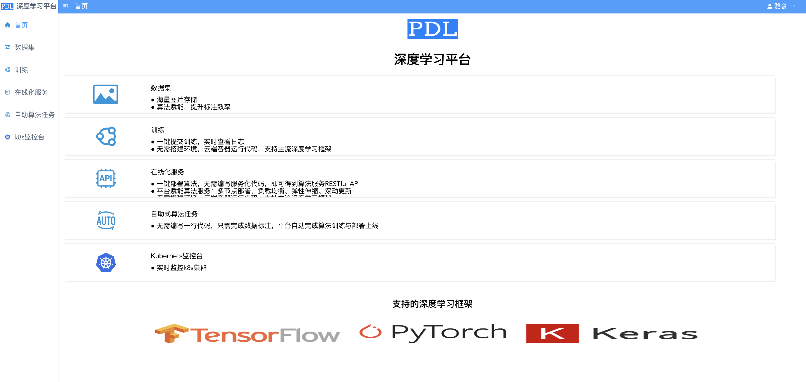

## 数据集
### 列表
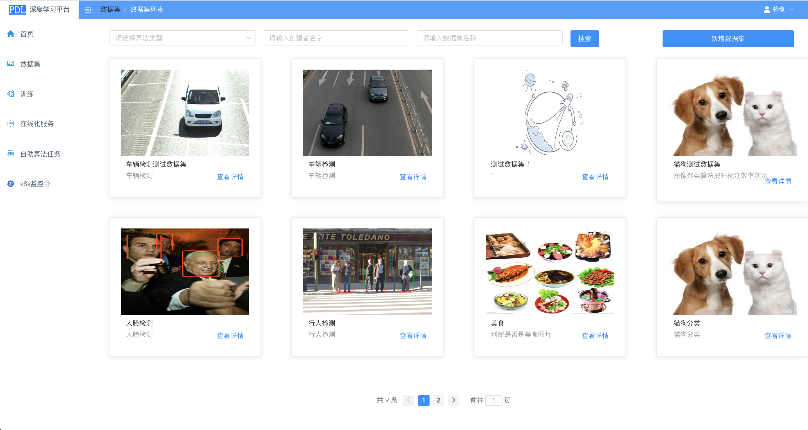
### 详情
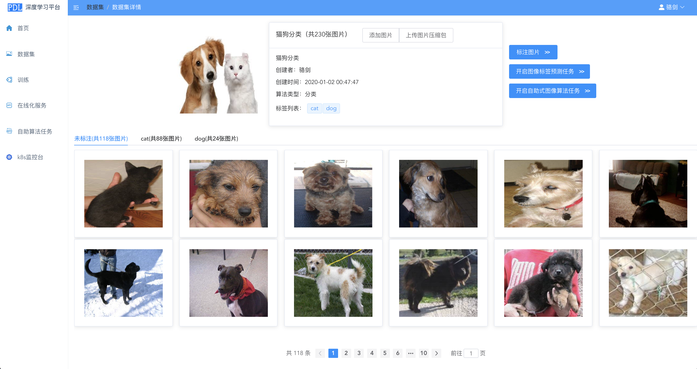
### 上传图片
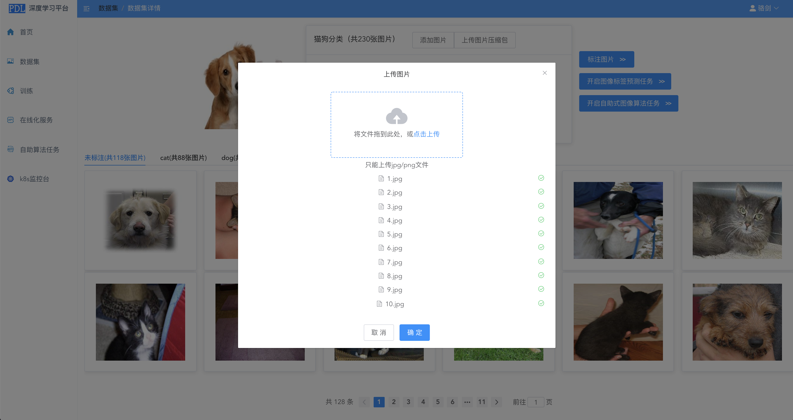
### 分类标注
### 自行标注
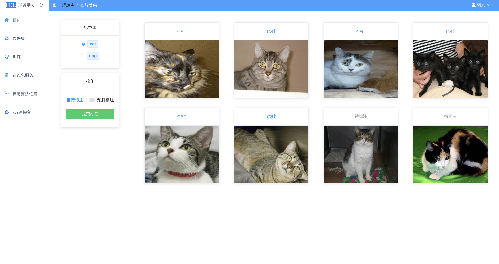
### 预测标注
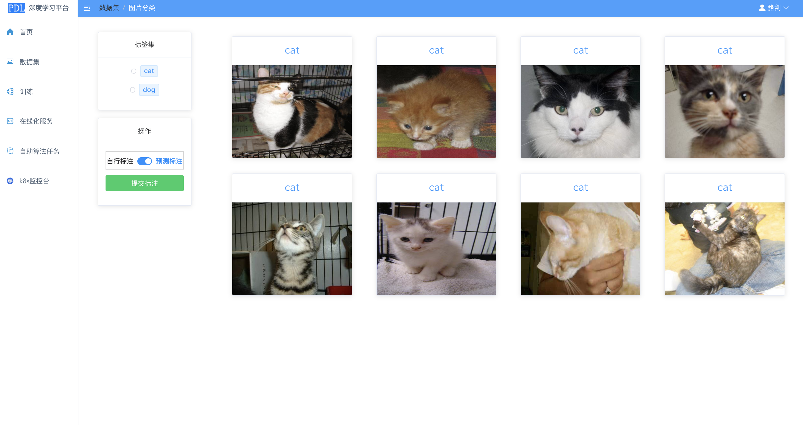
### 检测标注
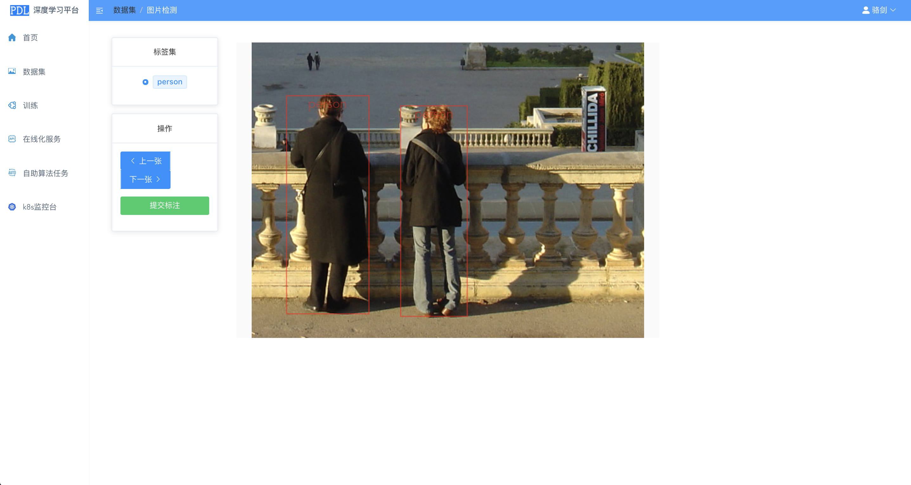

## 训练
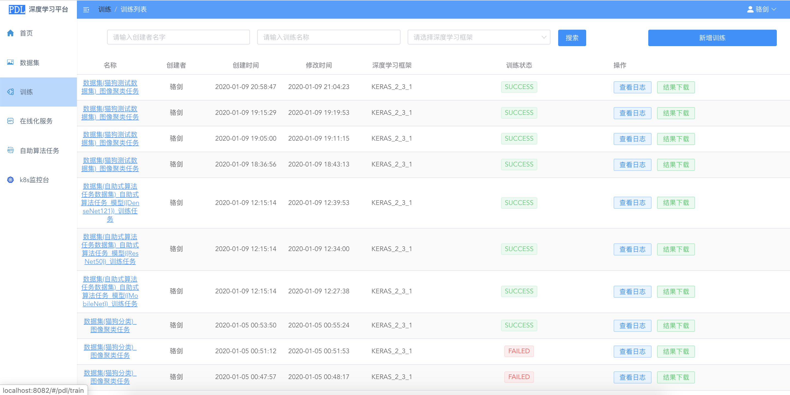


## 算法在线化服务
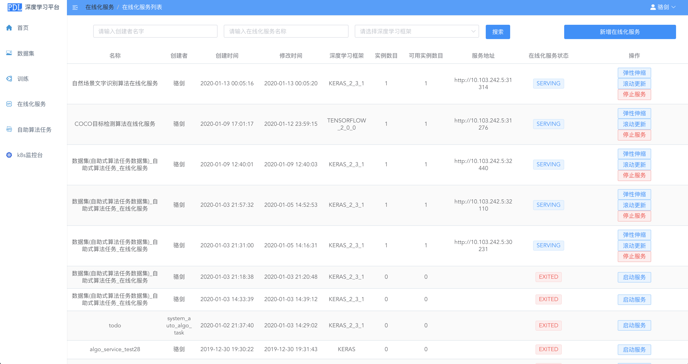
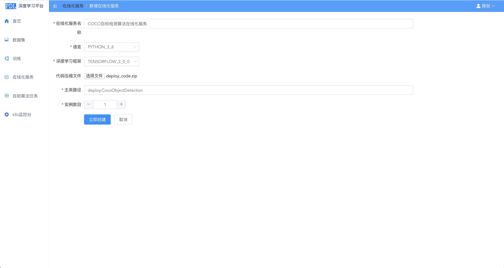

## 自助式图像算法任务
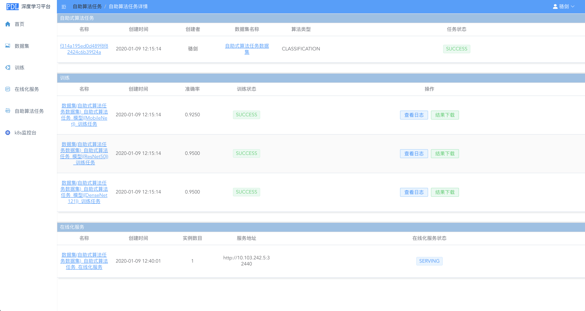


# 项目相关
## 文档命名规则
``` bash
-目录，用横线‘hello-world’
-文件，用横线‘hello-world’
-组件，用大驼峰式‘HelloWorld’
-变量，小驼峰式‘helloWorld’
```
## Eslint设置
``` bash
打开‘.eslintrc.js’ 修改‘rules’下的内容
```
## Build Setup

``` bash
# install dependencies
npm install

# serve with hot reload at localhost:8080
npm run dev

# build for production with minification
npm run build

# build for production and view the bundle analyzer report
npm run build --report
```

For a detailed explanation on how things work, check out the [guide](http://vuejs-templates.github.io/webpack/) and [docs for vue-loader](http://vuejs.github.io/vue-loader).
